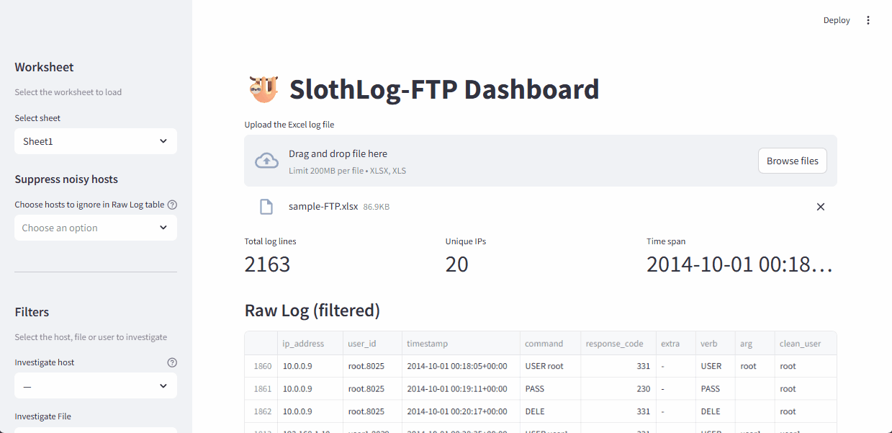
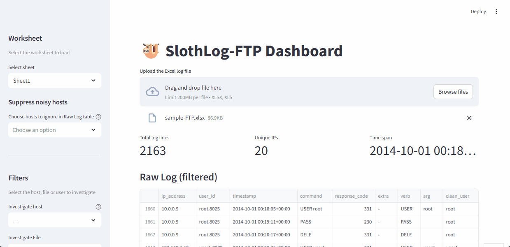

# 🦥 SlothLog - Analyse your logs, faster

*A lazy-looking but fast and effective forensic analyzer*


## Description

SlothLog is a modular Digital Forensics and Incident Response (DFIR) dashboard composed of two lightweight tools:

- slothlog-http: For **analyzing HTTP logs**
- slothlog-ftp : For **analyzing FTP logs**

Sloth-themed, yet fast at heart.


## When to use SlothLog?

Use SlothLog when you need a quick, interactive way to analyze logs for incident response or forensic investigations. It's ideal for identifying suspicious activity, tracking file uploads/downloads, profiling users or IP addresses, and generating visual insights - all of this without writing a single line of code or stressing too much with raw data.

---

## Features

- Parse, visualize and analyze FTP/HTTP logs
- User activity timeline view
- Extract IOCs (Indicators of Compromise)
- Filter by IP, timestamps, file paths, users, etc.
- Export JSON or CSV data for further processing
- Web UI via Streamlit

---


## Installation

```bash
git clone https://github.com/francevarotz98/slothlog.git
cd slothlog
```

### Optional: create a virtual environment

```bash
python3 -m venv venv
source venv/bin/activate  # Windows: venv\Scripts\activate
```

### Install dependencies

```bash
pip install -r requirements.txt 
# Note: streamlit>=1.45.0 needed
```

### Launch the dashboard

```bash
# analyse http logs
streamlit run src/slothlog-http.py

# analyse ftp logs
streamlit run src/slothlog-ftp.py
```

---

## Usage

In order to use the *slothlog* tools, you just need an excel file containing the logs. What? You don't have the excel file but only *raw* logs? CALM DOWN, in the _utils/_ folder you can find *convert_log-to-xlsx.py*, which can help you with the conversion, my little sloth.

To analyse **HTTP** logs, the excel file needs the following columns: host, timestamp, request, status, bytes, referer, user_agent

Instead, for **FTP** logs, the following columns are required in the excel: ip_address, timestamp, command, user_id, response_code

In the _samples/_ folder, I've uploaded a sample for HTTP and FTP excel files, so you can try it out. On purpose, samples have more columns than required.

### SlothLog-FTP Dashboard

Once the excel file is uploaded and processed, the **Raw Log table** initially displays every row exactly as in the original Excel file, with no filters applied.
On the left-hand side, instead, several options are present:

- _Select sheet_: it allows to change the sheet of the excel file to process; 
- _Suppress noisy hosts_: it allows to remove arbitrary hosts from the Raw Log table.

In the _Filters_ section there are 4 different options:

- _Investigate host_: it allows to analyze an arbitrary host. When a host is selected, its **profile** will be prompted in the main pane. Also, geographical info are displayed in the sidebar. The profile is a dictionary containing the following keys:
  - _users_ - a list of users that accessed the FTP server using the selected host;
  - _first\_seen_ - timestamp of the first time the host is present in the logs;
  - _last\_seen_ - timestamp of the last time the host is present in the logs;
  - _command\_mix_ - a dictionary of FTP commands - as keys, and number of times that command was employed by the host - as value;
  - _uploads\_success_ - a dictionary of **successfully** uploaded files by the host - as key, and number of times they have been (re-)uploaded - as value;
  - _downloads\_success_ - a dictionary of **successfully** downloaded files by the host - as key, and number of times they have been (re-)downloaded - as value;
- _Investigate File_: it allows to analyze the selected file. In the main pane the **Touch-Points table** is displayed; this contains all the rows where the chosen file is present in the excel file; 
- _Investigate User_: it allows to analyze an arbitrary user. When a user is selected, its **profile** will be prompted in the main pane. The profile is a dictionary containing the following keys:
  - _ips_ - a list of hosts that accessed the FTP server using the selected user;
  - _first\_seen_ - timestamp of the first time the user is present in the logs;
  - _last\_seen_ - timestamp of the last time the user is present in the logs;
  - _command\_mix_ - a dictionary of FTP commands - as keys, and number of times that command was employed by the user - as value;
  - _uploads\_success_ - a dictionary of **successfully** uploaded files by the user - as key, and number of times they have been (re-)uploaded - as value;
  - _downloads\_success_ - a dictionary of **successfully** downloaded files by the user - as key, and number of times they have been (re-)downloaded - as value;
- _Verb filter_: it allows to filter by the set of FTP verbs (e.g., STOR, RETR, PASS) present in the excel.

These filters are needed in order to choose the values to filter and analyze in the Raw Log table, in the main pane.

Besides the aformentioned functionalities, there's the **Quick Operations** section. At the moment, 5 operations have been implemented:

- _Downloaded files ↔ IPs_: this operation maps each **successfully** downloaded file to the IP addresses that retrieved it, along with the total number of downloads per file. It helps identify which hosts correctly accessed which files and how frequently;
- _Uploaded files ↔ IPs_: equivalent operation of the downloads but for uploads (note, also here only successfully uploaded files);
- _Command histogram for all_: this operation generates a histogram showing the frequency of each FTP command used across the entire log. It provides a quick overview of command usage patterns, helping to identify common behaviors or anomalies.
- _User activity history_: it displays a table containing all log entries associated with the selected user, matching the original log format. It also includes an interactive timeline plot visualizing the user's activity over time, making it easier to spot behavioral patterns or anomalies.
- _Host activity history_: it shows a full table of all log entries from the selected host, exactly as recorded in the log. An accompanying interactive plot visualizes the sequence and frequency of actions, helping visualize unusual or suspicious host behavior.

**Note**: _User activity history_ and _Host activity history_ should be called only after a user or host has been selected among the filters, respctively.

**Note 2**: operations do _not_ impact the Raw Log table.

**Note 3**: FTP servers generally append a process ID (PID) or session ID to the username to differentiate between parallel sessions. For example, _admin.32488_ might mean user _admin_ initiated a session handled by process ID 32488. For this reason, column _clean\_user_ is present in the Raw Log table.

#### Examples FTP

##### 1. Investigate specific User activity



##### 2. Investigate specific User that operated on a specific File


##### 3. Analyze only STOR operations performed by a user on a specific File



##### 4. Analyze activity history of a specific user


### SlothLog-HTTP Dashboard

Similar to SlothLog-FTP, also for the HTTP counterpart once the excel file is uploaded and processed, the **Raw Log table** initially displays every row exactly as in the original Excel file, with no filters applied. Moreover, the **User-Agent pie chart** shows the user-agent distribution present in the log.
On the left-hand side several options are present:

- _Select sheet_: it allows to change the sheet of the excel file to process; 
- _Suppress noisy hosts_: it allows to remove arbitrary hosts from the Raw Log table and the user-agent pie chart.

In the *Filters* section there are 5 different options:

- _Investigate host_: it allows to analyze an arbitrary host. When a host is selected, its **profile** will be prompted in the main pane. Also, geographical info are displayed in the sidebar. The profile is a dictionary containing the following keys:
  - _first\_seen_ - timestamp of the first time the host is present in the logs;
  - _last\_seen_ - timestamp of the last time the host is present in the logs;
  - _command\_mix_ - a dictionary of HTTP verbs - as keys, and number of times that verb was employed by the host - as value;
  - *user_agent* - a dictionary of user-agent employed - as keys, and number of times that user-agent was used by the the host - as value;
  - *requests* - a dictionary of requests performed by the host - as key, and number of times they have been called - as value;
- *Investigate path*: it allows to analyze the specific path present in the log. In the main pane the **Touch-Points table** is displayed; this contains all the rows where the *exact matches* requested path is present in the excel file. The Raw Log table instead will contain sub-paths and substrings, too;
- *Investigate query parameter*: it allows to analyze the specific query parameter present in the log. In the main pane the **Touch-Points table** is displayed; this contains all the rows where the *exact matches* query parameter is present in the excel file. The Raw Log table instead will show also matches with values and substrings of the selecter query parameter;
- *Investigare user agent*: it allows to filter requests by user-agent;
- *Investigate file extension*: it allows to filter requests by file extension requested by a host.
- _Verb filter_: it allows to filter by the set of HTTP verbs (e.g., GET, POST) present in the excel .

These filters are needed in order to choose the values to filter and analyze in the Raw Log table *and* in the User-agent pie chart, in the main pane.

Besides the previous filters, there's the **Quick Operations** section. At the moment, 3 operations have been implemented:

- *Requested path ↔ hostnames*: this operation maps each requested path to the hostname that retrieved it, along with the total number of downloads per path. It helps identify which hosts accessed which path and how frequently;
- *Command histogram for all*: this operation generates a histogram showing the frequency of each HTTP verb used across the entire log. It provides a quick overview of command usage patterns, helping to identify common behaviors or anomalies;
- *Host activity history*: it shows a full table in the main pane of all log entries from the selected host, exactly as recorded in the log. An accompanying interactive plot visualizes the sequence and frequency of actions, helping to visualize unusual or suspicious host behavior.


**Note**: *Host activity history* should be called only after a host has been selected among the filters.

**Note 2**: operations do _not_ impact the Raw Log table or the User-agent pie chart.

---

## TODO

- Make it (really) modular;
- Add functionality which downloads a Word report;
- Add checks for potentially-dangerous inputs;
- Add try/except blocks where needed;
- Optimize speed;

---

## 🤝 Contributing

Pull requests, issues, and ideas are welcome!

Include a short usage note in the header comment if possible.

## 💬 Contact

If this project saved your day, or blew something up in an unexpected way, drop me a line on Twitter or Linkedin.

Happy analysis!
